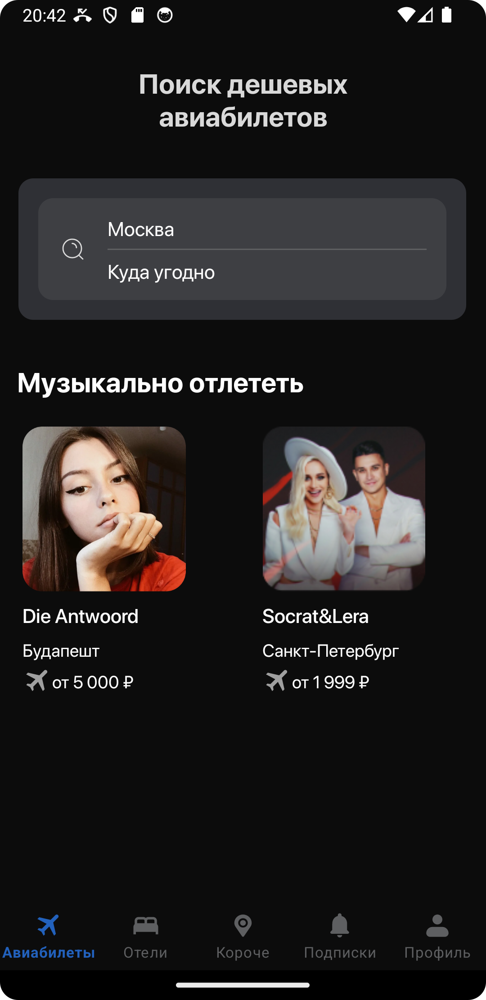
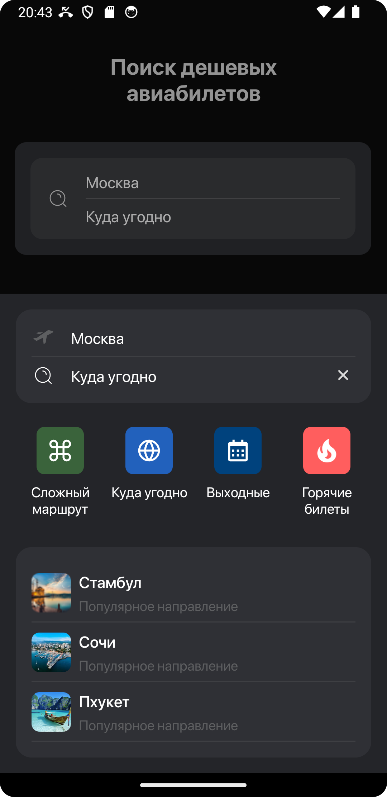
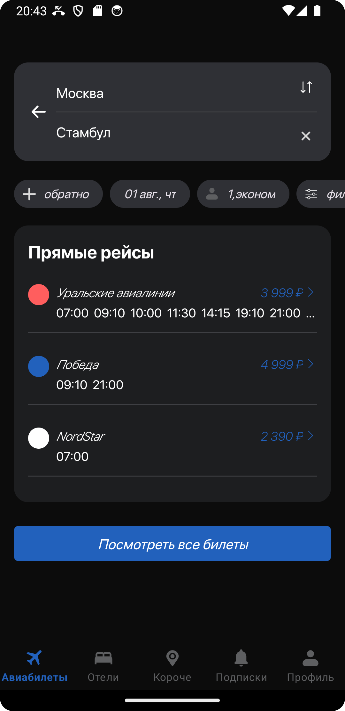
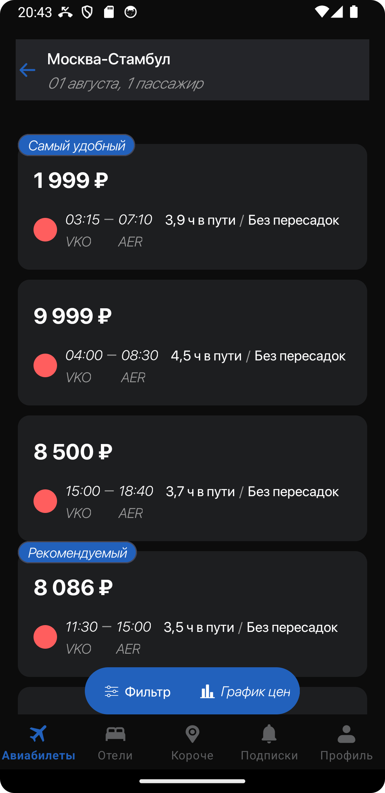

# Android ESales

Реализация 4 экранов:

1. Главная. Первый вход
2. Поиск
3. Поиск. Выбрана страна
4. Просмотреть все билеты

   Used [Тестовое-задание](https://www.figma.com/design/yWRLfKgmlEp7n0iKQg58hp/Effective-Mobile.-%D0%A2%D0%B5%D1%81%D1%82%D0%BE%D0%B2%D0%BE%D0%B5-%D0%B7%D0%B0%D0%B4%D0%B0%D0%BD%D0%B8%D0%B5-%D0%B4%D0%BB%D1%8F-%D1%80%D0%B0%D0%B7%D1%80%D0%B0%D0%B1%D0%BE%D1%82%D1%87%D0%B8%D0%BA%D0%BE%D0%B2.-%D0%9F%D1%80%D0%BE%D0%B4%D0%B0%D0%B6%D0%B0-%D0%B0%D0%B2%D0%B8%D0%B0%D0%B1%D0%B8%D0%BB%D0%B5%D1%82%D0%BE%D0%B2-(Copy)?node-id=2974-892&t=exbPSyqHfPOmKWo0-0 "Тестовое-задание")

## Используемые технологии

Android:
* Kotlin
* Retrofit
* Корутины
* Flow
* Dagger
* MVVM
* Верстка обычная на XML
* Clean Architecture
* Многомодульность (обязательно)

## Preview

## Главная. Первый вход

## Поиск

## Поиск. Выбрана страна

## Просмотреть все билеты

